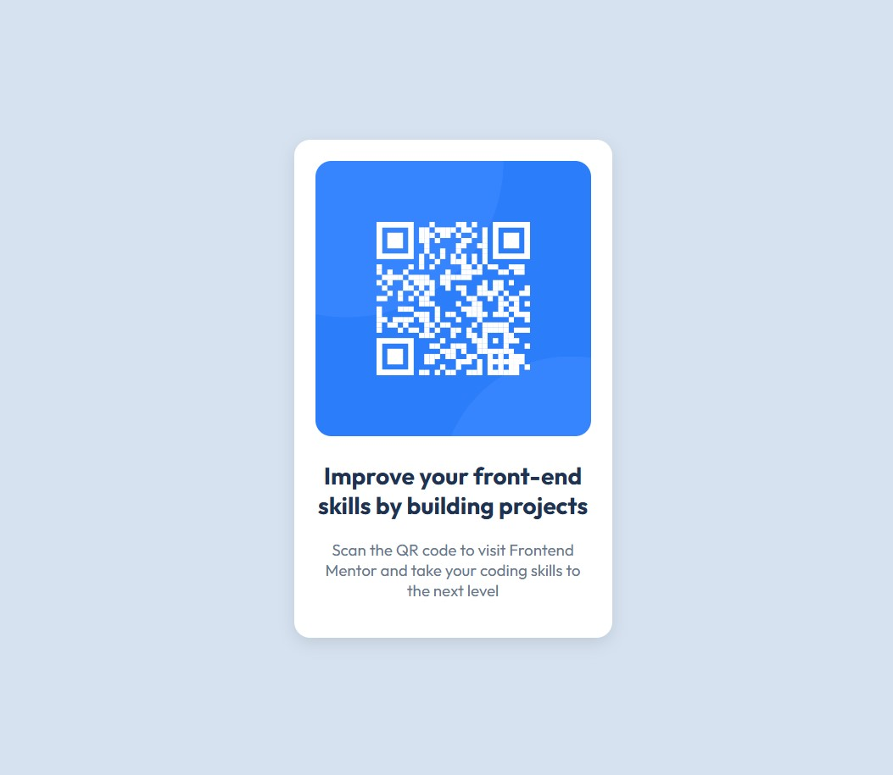

# Frontend Mentor - QR code component solution

This is a solution to the [QR code component challenge on Frontend Mentor](https://www.frontendmentor.io/challenges/qr-code-component-iux_sIO_H). Frontend Mentor challenges help you improve your coding skills by building realistic projects. 

## Table of contents

- [Overview](#overview)
  - [Screenshot](#screenshot)
  - [Links](#links)
- [Author](#author)

## Overview
A solution to QR code challenge as shown in the screenshot below. The solution is contained in the index.html file and styles.css file.

### Screenshot

### Links

- Live Site URL: [GitHub Pages](https://cookieinthebus.github.io/fm-qrcode-1/)

## Author

- Frontend Mentor - [@jasonlimas](https://www.frontendmentor.io/profile/jasonlimas)